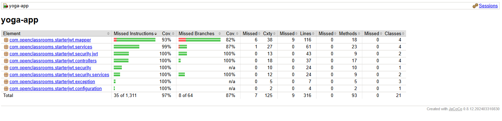
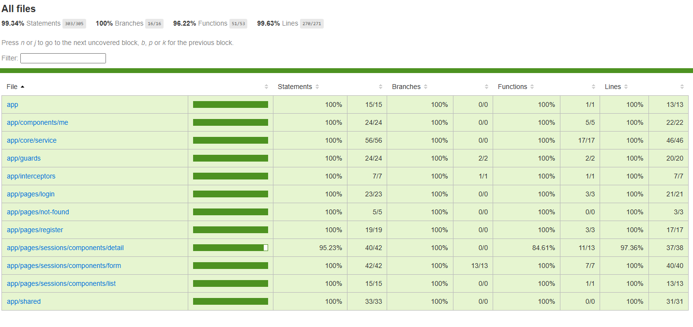
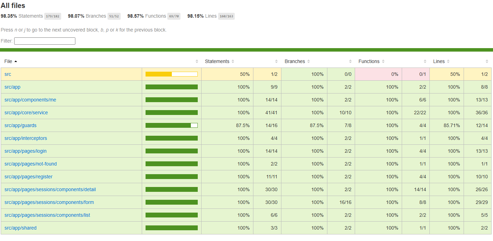

# Yoga App

Application full-stack de gestion de sessions de yoga.

- **Back** : Spring Boot 3 / Java 21 / MySQL (via Docker)
- **Front** : Angular 19 / Jest / Cypress

---

## Prérequis globaux

| Outil | Version minimale |
|---|---|
| JDK | 21 |
| Maven | 3.9.3 |
| Docker + Docker Compose | toute version récente |
| Node.js | 18+ |
| npm | 9+ |

---

## Installation et démarrage

### Back

```bash
cd back
mvn spring-boot:run
```

> Docker doit être démarré sur le poste. La commande démarre automatiquement le container MySQL via Docker Compose, puis lance l'API Spring Boot sur le port **8080**.

Lors du premier démarrage, insérer l'utilisateur admin dans la base :

```sql
INSERT INTO users(first_name, last_name, admin, email, password)
VALUES ('Admin', 'Admin', true, 'yoga@studio.com', '$2a$10$.Hsa/ZjUVaHqi0tp9xieMeewrnZxrZ5pQRzddUXE/WjDu2ZThe6Iq');
```

Identifiants admin : `yoga@studio.com` / `test!1234`

Pour plus de détails, voir [back/README.md](back/README.md).

### Front

```bash
cd front
npm install
npm run start
```

> Le front démarre sur le port **4200** et proxifie les appels API vers `http://localhost:8080`.

---

## Tests

### Back — tests unitaires et d'intégration (JUnit 5 / Mockito)

```bash
cd back
mvn test
```

Les tests unitaires (`*Test.java`) et les tests d'intégration (`*IT.java`) sont exécutés par Maven Surefire.  
Les tests utilisent une base **H2 en mémoire** (mode MySQL) — aucune dépendance externe requise.

### Front — tests unitaires (Jest)

```bash
cd front
npm test
```

Pour générer le rapport de couverture :

```bash
npm test -- --coverage
```

Pour lancer en mode watch :

```bash
npm run test:watch
```

### Front — tests E2E (Cypress)

Le back doit être démarré avant de lancer les tests E2E.

```bash
# Mode headless (CI)
cd front
npm run e2e:ci

# Mode interactif
npm run cypress:open
```

---

## Rapports de couverture

### Back (JaCoCo)

Le rapport est généré **automatiquement** à chaque exécution de `mvn test` :

```
back/target/site/jacoco/index.html
```

La vérification du seuil est intégrée à la phase `verify` :

```bash
cd back
mvn verify
```

Maven fait échouer le build si le seuil n'est pas atteint.

#### Seuils configurés (par package)

| Indicateur | Seuil |
|---|---|
| Instructions | ≥ 80 % |
| Lignes | ≥ 80 % |
| Branches | ≥ 80 % |

> Les DTOs, payloads de sécurité, repositories et la classe main sont exclus de la mesure.

*Exemple de résultat :*


### Front — couverture unitaire (Jest)

```bash
cd front
npm test -- --coverage
```

Rapport disponible ici :

```
front/coverage/jest/index.html
```

Jest fait échouer la commande si le seuil n'est pas atteint.

#### Seuils configurés (global)

| Indicateur | Seuil |
|---|---|
| Statements | ≥ 80 % |
| Branches | ≥ 80 % |
| Functions | ≥ 80 % |
| Lines | ≥ 80 % |

*Exemple de résultat :*


### Front — couverture E2E (nyc / Istanbul)

Lancer d'abord les tests E2E, puis générer le rapport :

```bash
cd front
npm run e2e:ci
npm run e2e:coverage
```

Rapport disponible ici :

```
front/coverage/lcov-report/index.html
```

*Exemple de résultat :*

